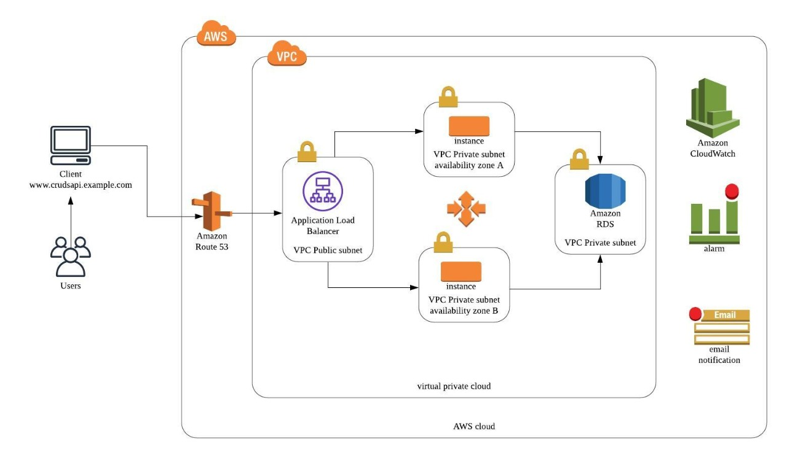

# Architecture Problem

### Description:
This architecture diagram will solve the  case study mentioned in https://github.com/chapagain/nodejs-mysql-crud.
 
    
### Architecture diagram

### AWS Architecture Implementation Details

1. Having a VPC with public and private subnets

2. Public subnet shoud route through Internet Gateway

3. Private subnets are routing to NAT Gateway

4. Created a LoadBalancer in public subnet by exposing port number 80 through load balancer security group

5. Created instances in private subnets(availability zone a & b) by allowing traffic from load balancer security group to instance security group.

6. Created a database (MySQL RDS) in private subnet by allowing traffic from instance security group to database security group.

7. Created a launch configuration with deployed application AMI.

8. Created a autoscaling group by attaching with created launch configuration 

9. Created scaling policies based on the load balancer traffic (number of requests) and instance cpu utiliziation.

URL to access Application : http://nodeapplb-1603884094.us-west-2.elb.amazonaws.com/
